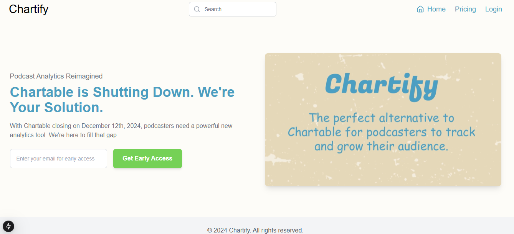

# Chartify



## 🎙️ The Next-Gen Podcast Analytics Tool

Chartify is your go-to solution for comprehensive podcast analytics, designed to fill the void left by Chartable's shutdown. Built with cutting-edge technologies, Chartify offers podcasters powerful insights and analytics to grow their audience and optimize their content.

## 🚀 Early Bird Offer!

🎉 **Get 20% Premium Features FREE!** 🎉

Register now to secure your early bird offer and elevate your podcast game!

[Sign Up for Early Access](https://projectify.fun)

## ✨ Features

- 📊 Comprehensive podcast analytics dashboard
- 👥 Audience demographics and listener behavior insights
- 🌍 Geographic distribution of your listeners
- 📈 Episode performance metrics
- 🔗 Attribution and marketing campaign tracking
- 🎨 Beautiful, interactive charts and visualizations
- 📱 Responsive design for desktop and mobile

## 🛠️ Technologies Used

- **Frontend:**
  - Next.js
  - TypeScript
  - shadcn/ui
  - Framer Motion for animations
  - Recharts for data visualization

- **Backend:**
  - Node.js
  - Express.js
  - MongoDB for data storage

- **Authentication:**
  - NextAuth.js

- **Deployment:**
  - VPS (Frontend)
  - MongoDB Atlas (Database)

## 🚀 Getting Started

### Prerequisites

- Node.js (v14 or later)
- npm or yarn
- MongoDB

## ⚙️ Installation

To run the project locally, follow these steps:

Clone the repository:
   ```bash
   git clone https://github.com/cykoravish/chartify-next.git
   cd chartify-next
   npm install
   npm run dev
```
## 🔑 Features to Come

   - Advanced Analytics Reports
   - Integration with additional podcast platforms
   - Real-time audience insights
   - Support for premium podcast hosting services

## 📢 Contributing

If you'd like to contribute to the development of Chartify, feel free to open an issue or submit a pull request. We welcome contributions that improve the user experience, add new features, or fix bugs!

    Fork the repository.
   - Create a new branch (git checkout -b feature-name).
   - Commit your changes (git commit -am 'Add feature-name').
   - Push to the branch (git push origin feature-name).
   - Create a new pull request.

##   📬 Contact

For more information or inquiries, please contact us at [ravishbisht86@gmail.com]
